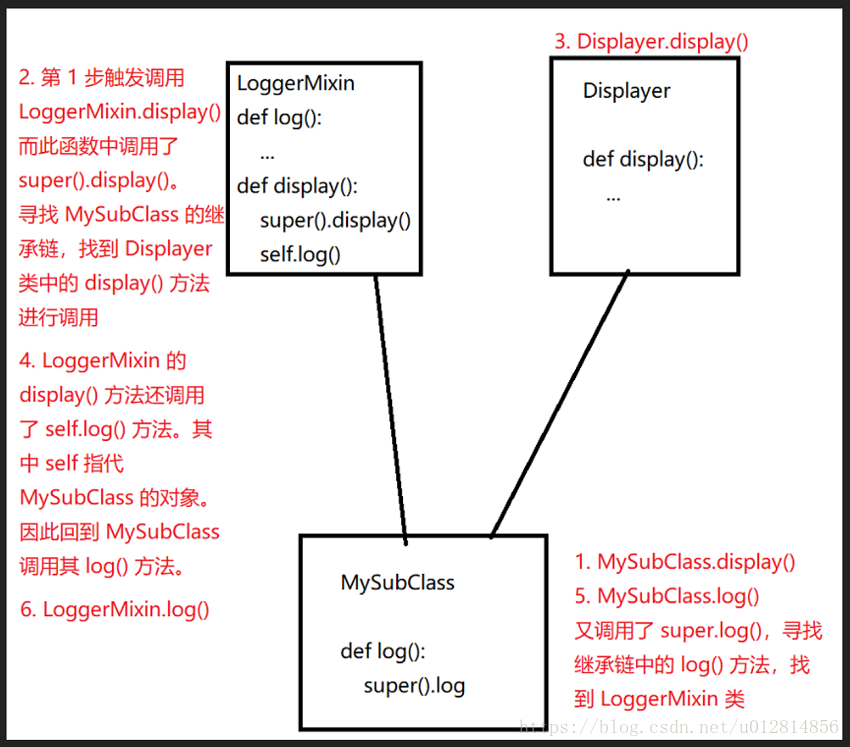

# python进阶15多继承与Mixin
## Mixin解释
为了让大家，对这个 Mixin 有一个更直观的理解，摘录了网上一段说明。

民航飞机是一种交通工具，对于土豪们来说直升机也是一种交通工具。对于这两种交通工具，它们都有一个功能是飞行，但是轿车没有。所以，我们不可能将飞行功能写在交通工具这个父类中。但是如果民航飞机和直升机都各自写自己的飞行方法，又违背了代码尽可能重用的原则（如果以后飞行工具越来越多，那会出现许多重复代码）。

怎么办，那就只好让这两种飞机同时继承交通工具以及飞行器两个父类，这样就出现了多重继承。这时又违背了继承必须是”is-a”关系。这个难题该怎么破？

这时候 Mixin 就闪亮登场了。飞行只是飞机做为交通工具的一种（增强）属性，我们可以为这个飞行的功能单独定义一个（增强）类，称之为 Mixin 类。这个类，是做为增强功能，添加到子类中的。为了让其他开发者，一看就知道这是个 Mixin 类，一般都要求开发者遵循规范，在类名末尾加上 Mixin 。


举个例子

```
class Vehicle(object):
    pass

class PlaneMixin(object):
    def fly(self):
        print('I am flying')

class Airplane(Vehicle, PlaneMixin):
    pass
```
使用Mixin类实现多重继承要遵循以下几个规范

责任明确：必须表示某一种功能，而不是某个物品；

功能单一：若有多个功能，那就写多个Mixin类；

绝对独立：不能依赖于子类的实现；子类即便没有继承这个Mixin类，也照样可以工作，就是缺少了某个功能。


## 一个 Mixin 类的实例(这个例子并不符合前面的无依赖原则)
这里，我直接先上代码，有兴趣的同学，可以暂停到这里，看看这段代码中的 subclass.display() 这行代码，究竟是怎么执行的：
```
class Displayer():
    def display(self, message):
        print(message)


class LoggerMixin():
    def log(self, message, filename='logfile.txt'):
        with open(filename, 'a') as fh:
            fh.write(message)

    def display(self, message):
        super().display(message)
        self.log(message)


class MySubClass(LoggerMixin, Displayer):
    def log(self, message):
        super().log(message, filename='subclasslog.txt')


subclass = MySubClass()
subclass.display("This string will be shown and logged in subclasslog.txt")
```
代码不多，也就拢共 22 行，22 行的代码里面，定义了 3 个类。其中 MySubClass 多继承了 LoggerMixin 类和 Displayer 类。看似并没有什么异常的代码里面，当你尝试去仔细推敲 subclass.display() 的调用逻辑之后，就变得异常的复杂。

问题:我们的 LoggerMixin 类是怎么调用的 super().display() 方法的呢？

解答:在多继承的环境下，super() 有相对来说更加复杂的含义。它会查看你的继承链，使用一种叫做 Methods Resolution Order（方法解析顺序） 的方式，来决定调用最近的继承父类的方法。

也就是说，我们的 MySubClass.display() 调用，触发了是这么一系列的行为：

```
1. MySubClass.display() is resolved to LoggerMixin.display().
MySubClass.display() 方法被解析为 LoggerMixin.display() 方法的调用。这应该还是比较好理解的。因为对于 MySubClass 类来说，在继承链上的两个父类，LoggerMixin 和 Displayer 来说，LoggerMixin 是最近的，因此调用它的 display() 方法。

2. LoggerMixin.display() calls super().display(), which is resolved to Displayer.display().
LoggerMixin.display() 方法调用了 super().display()，这一行代码按照我们刚才的解释，查看 MySubClass 的继承链，是应该调用 Displayer 类的 display() 方法的。这一步是相对来说比较难以理解的。

让我们这么来理解它，当 LoggerMixin.display() 中调用了 super().display() 的时候，它会尝试去寻找属于当前类的继承链。而这个当前类是什么类呢？不是 LoggerMixin 类，而是 MySubClass 类。MySubClass 类的继承连是 LoggerMixin，然后 Displayer。所以，我们就找到了 Displayer 的 display() 方法。

3. It alse calls self.log(). Since self, in this case, is a MySubClass instance, it resolves to MySubClass.log(). MySubClass.log() calls super().log(), which is resolved back to LoggerMixin.log().
别忘了，我们的 LoggerMixin 类还调用了 self.log() 方法。这个看似好像要直接调用 LoggerMixin 的 log 方法，其实不然。

LoggerMixin 的 display() 方法在当前语境中的 self，其实是 MySubClass 类的对象，因此对于 MySubClass 类的对象，想要调用 log 方法，是直接调用自己类中的 log 方法，也就是 MySubClass.log() 方法，而不是 LoggerMixin.log() 方法的。

而又因为 MySubClass.log() 方法调用了 super().log() 方法，这才根据继承链寻找最近的父类，才找到了 LoggerMixin 类中的 log() 方法进行调用。
```
## 画图总结

为了方便大家理解，我画了一个简略的图方便理解：

一句简单的 subclass.display() 的背后，究竟发生了什么？




## 参考
一个例子走近 Python 的 Mixin 类：利用 Python 多继承的魔力：https://blog.csdn.net/u012814856/article/details/81355935

1.9 多继承与Mixin设计模式：python.iswbm.com/en/latest/c01/c01_09.html


