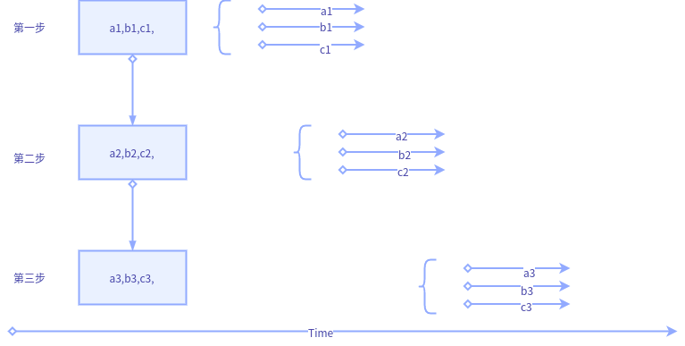
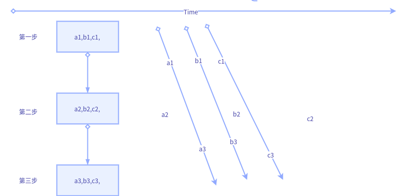

# python进阶10并发之六并行化改造
图示变量含义说明:  
1个大step中包含3个小step,大step内部的第一步，二步，三步存在依赖关系（就是内部保持顺序执行）  
a1,b1,c1,表示子任务a的第一步，b的第一步，c的第一步.同理a2,表示子任务a的第二步。    
## 无并行
  
## 水平并行
优点：修改简单，容易排错  
缺点：使用场景有限，适合批量数据，不适合流式数据  
实现：pool().map(step1);pool().map(step2);pool().map(step3)      
  

## 垂直并行  
优点：修改简单，容易排错  
缺点：如果中间步骤耗时过多，上游依然处于限制状态  
实现：pool().apply_sync(func(step1,step2,step3))  
  

## 生产者消费者
优点：上下游耦合小，任务粒度更细  
缺点：改造稍微复杂，需考虑生产者生成结束等特殊情况的兼容，并且调试也较麻烦  
实现：Queue(多进程multiprocessing,Queue,多线程queue.Queue,python大多多进程)  
  

## 协程
协成可看做特殊单线程（意味着本质是单线程，多线程是表象），任务角度多个线程同时执行，实时角度看只有一个线程真正执行，好处是无需处理线程共享数据的加锁等情况（因为只有一个线程会执行，不存在同时修改的情况）。还有就是其**进程内部不需要操作系统调度**（进程整体肯定是操作系统调度，否则就凌驾与操作系统了），**会自行调度**，释放时间片给其他内部线程。  
常规的线程一旦得到cpu时间片，会毫不犹豫执行，哪怕处于sleep状态也会占用资源。而协程则不会，其会把cpu主动出让(给自己其他线程)，等到别人"呼唤"自己时才会真正执行（比如next（自己）,gevent.sleep时间到了也算唤醒）。
目前对协程的体会并不深，基本上就是循环改yield，然后外层通过next(send)触发不断的类似时序的执行(本博客前面有写过yield的专题,自行翻阅)。复杂协程也未写过，所以不做过多描述了，免得误人子弟。  
关键词:yield,gevent  

## 事件
优点：如果可以不同事件自动并行化(不确定python是否已实现)，基本上生产者消费者所有优点都具备，并且，额外还有容易追溯，调试的好处.  
缺点：程序架构需调整。改动最大.  
实现：signal(python,django)  
这个严格来说，并不属于并行范畴，但是将其放到这里，因为其和生产者消费者有共通之处，而且协程的实现底层也是基于事件模型。   
生产者消费者存在很大问题，就是难以调试以及流程难以控制，由于切分粒度很细，并且不同步骤之间几乎独立，虽然可以保证整体的顺序执行以及最终任务可完成，但其上下游关系难以追溯，一旦出错也难以复现。所以个人很排斥生产者消费者这种方式。  
而事件则不同，生产完成后将信息注册到事件链中，不但可以保存任务结束的result,还可以传递任务本身初始参数信息。每个事件都可以看做独立函数，即使某一个出错，也可以将事件参数作为debug锚点进行追踪。  
django的事件模型用信号实现的，尚不确定是否是并发的。理论上来说，同类型事件应该可以串行，非同类事件并行，是比较稳妥的处理方式。但保不齐Python事件共享了同一事件通道。同时只执行一个事件，那样的话效率就未见得高了。  

用事件的方式实现生产消费和协程效率应该类似，如果事件引擎支持多进程的话(不考虑GIL，多线程也行），那么效率会更高，毕竟协程只是单线程的。

